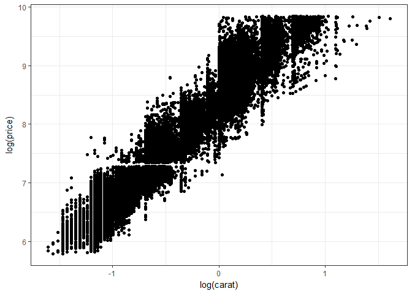
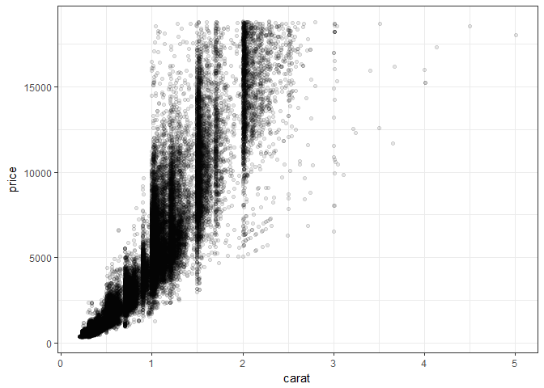

An overview of Data Visualization in R
================
Pavan Gurazada
2018-01-31

``` r
library(tidyverse)

set.seed(20130810)
theme_set(theme_bw())

dev.new()

data("diamonds")
glimpse(diamonds)
```

    ## Observations: 53,940
    ## Variables: 10
    ## $ carat   <dbl> 0.23, 0.21, 0.23, 0.29, 0.31, 0.24, 0.24, 0.26, 0.22, ...
    ## $ cut     <ord> Ideal, Premium, Good, Premium, Good, Very Good, Very G...
    ## $ color   <ord> E, E, E, I, J, J, I, H, E, H, J, J, F, J, E, E, I, J, ...
    ## $ clarity <ord> SI2, SI1, VS1, VS2, SI2, VVS2, VVS1, SI1, VS2, VS1, SI...
    ## $ depth   <dbl> 61.5, 59.8, 56.9, 62.4, 63.3, 62.8, 62.3, 61.9, 65.1, ...
    ## $ table   <dbl> 55, 61, 65, 58, 58, 57, 57, 55, 61, 61, 55, 56, 61, 54...
    ## $ price   <int> 326, 326, 327, 334, 335, 336, 336, 337, 337, 338, 339,...
    ## $ x       <dbl> 3.95, 3.89, 4.05, 4.20, 4.34, 3.94, 3.95, 4.07, 3.87, ...
    ## $ y       <dbl> 3.98, 3.84, 4.07, 4.23, 4.35, 3.96, 3.98, 4.11, 3.78, ...
    ## $ z       <dbl> 2.43, 2.31, 2.31, 2.63, 2.75, 2.48, 2.47, 2.53, 2.49, ...

``` r
dsmall <- diamonds %>% sample_n(size = 100)
glimpse(dsmall)
```

    ## Observations: 100
    ## Variables: 10
    ## $ carat   <dbl> 1.01, 0.70, 0.31, 0.30, 1.02, 0.31, 0.51, 1.53, 1.03, ...
    ## $ cut     <ord> Premium, Good, Premium, Premium, Good, Premium, Ideal,...
    ## $ color   <ord> H, D, F, D, E, H, E, I, J, F, I, G, F, G, E, I, D, D, ...
    ## $ clarity <ord> VS2, VS2, SI1, VS2, SI2, SI1, VS1, SI1, I1, SI1, VVS1,...
    ## $ depth   <dbl> 62.3, 63.4, 60.6, 61.9, 64.3, 61.7, 61.8, 63.1, 62.8, ...
    ## $ table   <dbl> 58, 57, 60, 58, 58, 59, 55, 56, 55, 55, 58, 54, 59, 56...
    ## $ price   <int> 4412, 2960, 663, 911, 4478, 558, 1697, 7797, 2392, 583...
    ## $ x       <dbl> 6.45, 5.60, 4.37, 4.32, 6.36, 4.39, 5.15, 7.32, 6.43, ...
    ## $ y       <dbl> 6.36, 5.67, 4.34, 4.28, 6.26, 4.36, 5.18, 7.26, 6.41, ...
    ## $ z       <dbl> 3.99, 3.57, 2.64, 2.66, 4.06, 2.70, 3.19, 4.60, 4.03, ...

**What is data, in the context of a plot?** Aesthetic attributes (e.g., color, size and shape) of observations are visual properties that affect the way observations are displayed. Each aesthetic is controlled by a scale This script is a birds eye view of plot types possible with ggplot2 Not to be taken seriously *Practical plotting using qplot*

``` r
attach(diamonds)
qplot(carat, price)
```


``` r
qplot(log(carat), log(price))
```



``` r
qplot(carat, x * y * z)
```


``` r
detach(diamonds)

attach(dsmall)
qplot(carat, price, color = color)
```


``` r
qplot(carat, price, shape = cut)
```


``` r
detach(dsmall)

attach(diamonds)
qplot(carat, price, alpha = I(1/10))
```



``` r
qplot(carat, price, alpha = I(1/100))
```


``` r
qplot(carat, price, alpha = I(1/200))
```


``` r
detach(diamonds)
```

Adding smoothers to the plots

``` r
qplot(carat, price, data = dsmall, geom = c("point", "smooth"))
```

    ## `geom_smooth()` using method = 'loess'


``` r
qplot(carat, price, data = diamonds, geom = c("point", "smooth"))
```

    ## `geom_smooth()` using method = 'gam'


Jitters and boxplots

``` r
qplot(color, price/carat, data = diamonds, geom = "jitter")
```


``` r
qplot(color, price/carat, data = diamonds, geom = "boxplot")
```


``` r
qplot(color, price/carat, data = diamonds, geom = "jitter", alpha = I(1/100))
```


Histograms and densities

``` r
qplot(carat, data = diamonds, geom = "histogram")
```

    ## `stat_bin()` using `bins = 30`. Pick better value with `binwidth`.


``` r
qplot(carat, data = diamonds, geom = "density")
```


``` r
qplot(color, data = diamonds, geom = "bar")
```


Compare distributions of subgroups

``` r
qplot(carat, data = diamonds, geom = "density", colour = color)
```


``` r
qplot(carat, data = diamonds, geom = "histogram", fill = color)
```

    ## `stat_bin()` using `bins = 30`. Pick better value with `binwidth`.


``` r
qplot(color, data = diamonds, geom = "bar", weight = carat) +
  scale_y_continuous("carat")
```


Line plots

Think what the geometry "line" means?

``` r
qplot(date, unemploy/pop, data = economics, geom = "line")
```


``` r
qplot(date, uempmed, data = economics, geom = "line")
```


Faceting, employs formulas row\_var ~ col\_var, say what?

``` r
qplot(carat, data = diamonds, facets = color ~ ., 
      geom = "histogram", binwidth = 0.1)
```


``` r
qplot(carat, ..density.., data = diamonds, facets = color ~ ., 
      geom = "histogram", binwidth = 0.1)
```


Axis labels, etc

``` r
qplot(carat, price/carat, data = dsmall,
      ylab = expression(frac(price, carat)),
      xlab = "Weight (carats)",
      main = "Small diamonds",
      xlim = c(0.2, 1))
```

    ## Warning: Removed 27 rows containing missing values (geom_point).


``` r
qplot(carat, price, data = dsmall, log = "xy")
```


