Building plots layer by layer
================
Pavan Gurazada
2018-01-31 14:17:21

``` r
library(tidyverse)
library(nlme)
library(lme4)

set.seed(20130810)
theme_set(theme_bw())
```

Each layer of a plot has a life of its own. In fact, each layer may even come from a different data set! The components of a layer are: data(frame), aesthetic mappings, the geometry, the statistic that is applied to the data, and position adjustments to avoid overplotting.

``` r
ggplot(diamonds, aes(x = carat, y = price, color = cut))
```

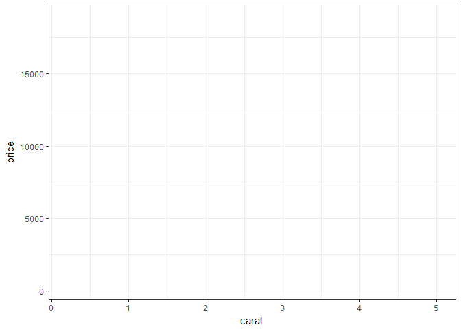

This returns a plot object mapping the data to aesthetics. However, the geometry is not specified, so there is nothing to see A strict specification following the grammer would force the addition of layers, like so:

``` r
ggplot(diamonds, aes(x = carat)) +
  layer(geom = "bar",
        position = "identity",
        stat = "bin",
        params = list(fill = "steelblue",
                      binwidth = 2))
```


To avoid such cumbersome code, several shortcut helper functions exist that aid addition of layers which directly control the specifics of the layer It is worthwhile to pause and ponder how each of the layer components are built up here

``` r
ggplot(diamonds, aes(x = carat)) +
  geom_histogram(binwidth = 2, fill = "steelblue")
```

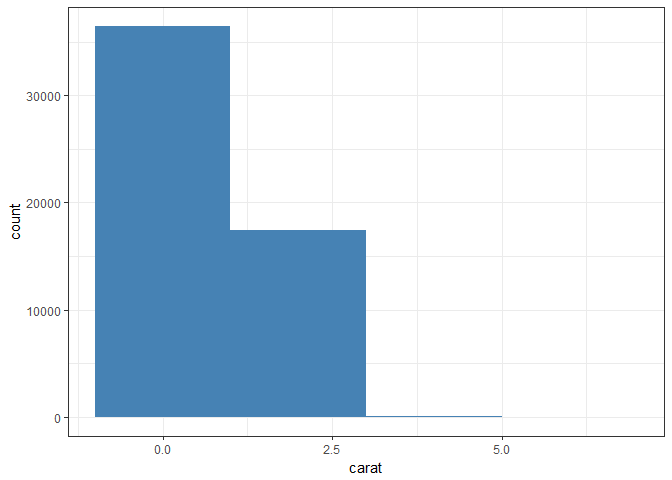

``` r
ggplot(msleep, aes(x = sleep_rem/sleep_total, y = awake)) +
  geom_point() + 
  geom_smooth()
```

    ## `geom_smooth()` using method = 'loess'

    ## Warning: Removed 22 rows containing non-finite values (stat_smooth).

    ## Warning: Removed 22 rows containing missing values (geom_point).

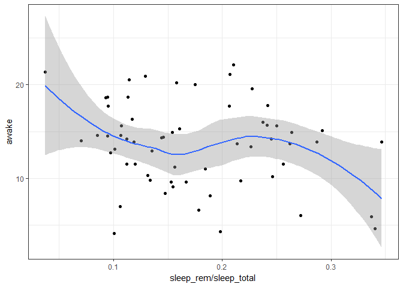

Layers are R objects and hence can be used with different datasets without duplication

``` r
bestFit <- geom_smooth(method = "lm", 
                       se = FALSE, 
                       color = alpha("steelblue", 0.5),
                       size = 2)
qplot(sleep_rem, sleep_total, data = msleep) + bestFit
```

    ## Warning: Removed 22 rows containing non-finite values (stat_smooth).

    ## Warning: Removed 22 rows containing missing values (geom_point).

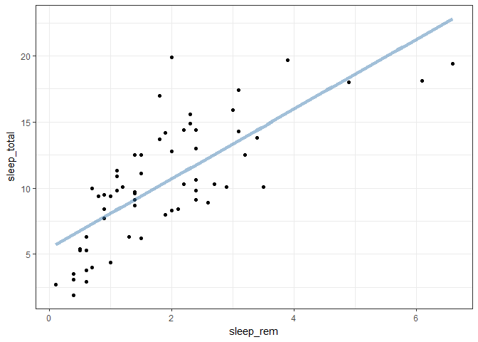

``` r
qplot(awake, brainwt, data = msleep, log = "y") + bestFit
```

    ## Warning: Removed 27 rows containing non-finite values (stat_smooth).

    ## Warning: Removed 27 rows containing missing values (geom_point).

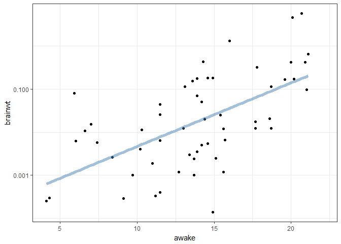

``` r
qplot(bodywt, brainwt, data = msleep, log = "xy") + bestFit
```

    ## Warning: Removed 27 rows containing non-finite values (stat_smooth).

    ## Warning: Removed 27 rows containing missing values (geom_point).

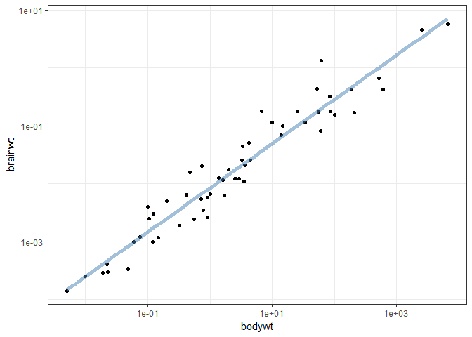

The default aesthetic mapping in the plot can be overwritten or extended by further layers. Use layers with care to reflect what you want to express

``` r
ggplot(mtcars, aes(x = mpg, y = wt)) +
  geom_point(aes(color = factor(cyl)))
```


``` r
ggplot(mtcars, aes(x = mpg, y = wt)) +
  geom_point(aes(color = factor(cyl))) +
  geom_point(aes(y = disp))
```

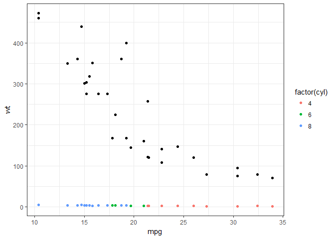

We can map an aesthetic to a variable or set it to be a constant. Note the difference

``` r
ggplot(mtcars, aes(x = mpg, y = wt)) +
  geom_point(aes(color = factor(cyl)))
```

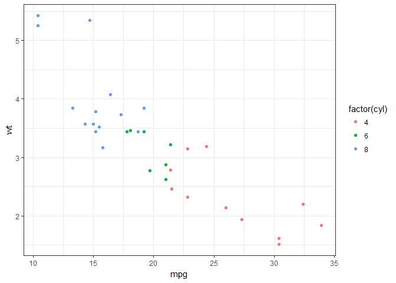

``` r
ggplot(mtcars, aes(x = mpg, y = wt)) +
  geom_point(color = "darkblue")
```

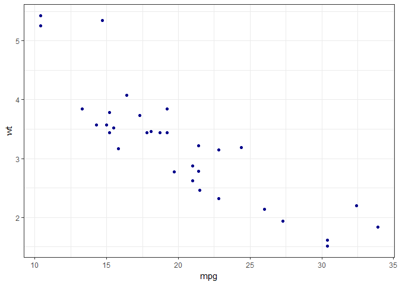

``` r
ggplot(mtcars, aes(x = mpg, y = wt)) +
  geom_point(aes(color = "darkblue"))
```

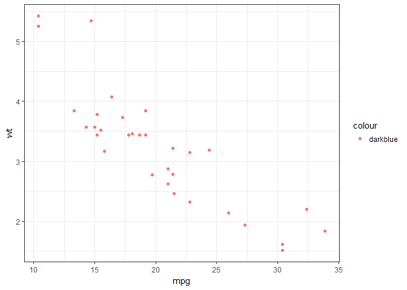

**OXBOYS data -- Age and height of 26 boys were measured on 9 occasions** *How does the height of boys change with age?* Geometries are divided into a range of individual-level geoms (e.g., points) at one end and group-level geoms (e.g., smoothers) at the other.

``` r
glimpse(Oxboys) 
```

    ## Observations: 234
    ## Variables: 6
    ## $ Subject      <ord> 1, 1, 1, 1, 1, 1, 1, 1, 1, 2, 2, 2, 2, 2, 2, 2, 2...
    ## $ age          <dbl> -1.0000, -0.7479, -0.4630, -0.1643, -0.0027, 0.24...
    ## $ height       <dbl> 140.5, 143.4, 144.8, 147.1, 147.7, 150.2, 151.7, ...
    ## $ Occasion     <ord> 1, 2, 3, 4, 5, 6, 7, 8, 9, 1, 2, 3, 4, 5, 6, 7, 8...
    ## $ fittedValues <dbl> 141.0007, 142.7968, 144.8266, 146.9547, 148.1061,...
    ## $ residuals    <dbl> 0.50066352, -0.60320946, 0.02660644, -0.14525734,...

``` r
ggplot(Oxboys, aes(x = age, y = height, group = Subject)) +
  geom_line()
```


Incorrect line plot that does not convey what we wish to explore here group = 1, i.e., we are saying that all the data is from the same individual There is no variation per sample

``` r
ggplot(Oxboys, aes(x = age, y = height)) +
  geom_line()
```

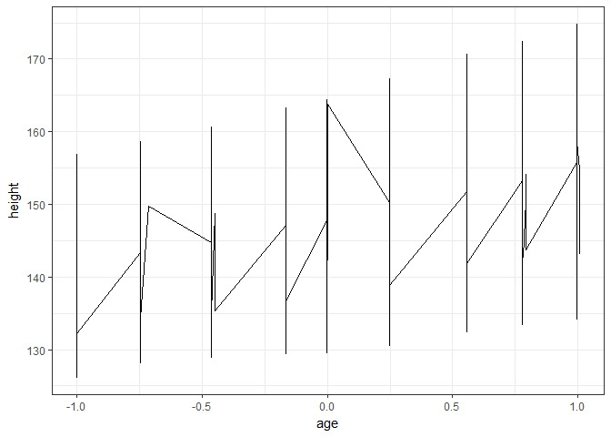

When we wish to summarize the data, we do not want to summarize each individual but rather the entire group So, we want to do

``` r
ggplot(Oxboys, aes(x = age, y = height, group = Subject)) +
  geom_line() + 
  geom_smooth(aes(group = 1), method = "lm")
```

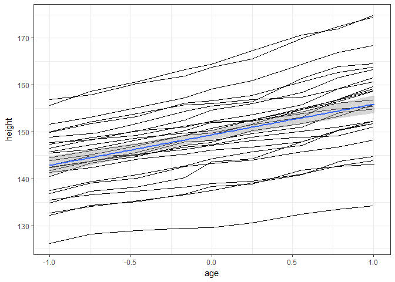

And not

``` r
ggplot(Oxboys, aes(x = age, y = height, group = Subject)) +
  geom_line() + 
  geom_smooth(method = "lm")
```

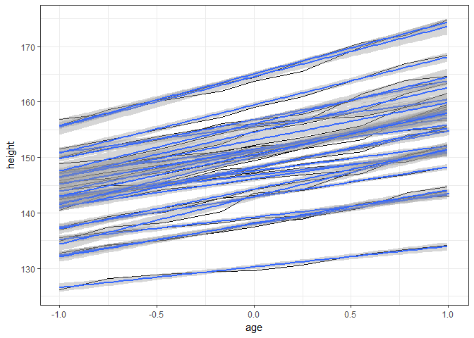

Notice how the aesthetics control the actual data plot. *How does the age of the boys vary by occasion?*

``` r
ggplot(Oxboys, aes(x = Occasion, y = height)) +
  geom_boxplot()
```

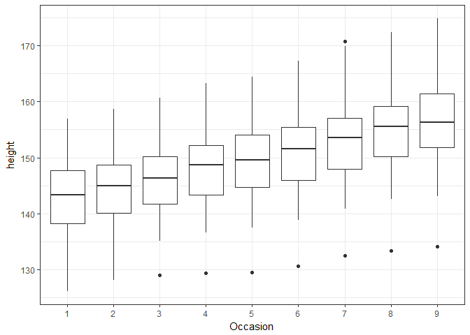

We can add in the individual heigh lines, but it does not make much of sense

``` r
ggplot(Oxboys, aes(x = Occasion, y = height)) +
  geom_boxplot() + 
  geom_line(aes(group = Subject), color = "steelblue")
```

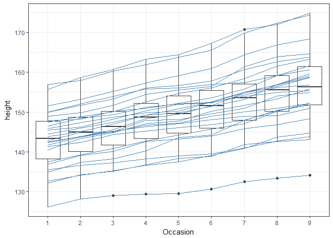

**DIAMONDS DATA** *What is the distribution of diamonds by color and grouped by cut?*

``` r
ggplot(diamonds, aes(x = color)) +
  geom_bar()
```

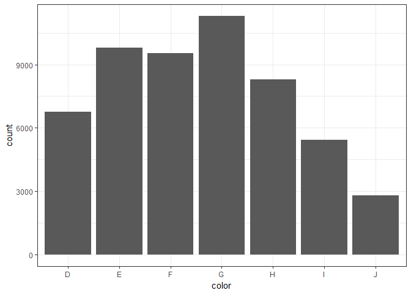

``` r
ggplot(diamonds, aes(x = color, fill = cut)) +
  geom_bar()
```

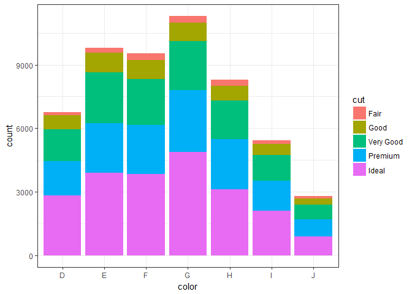

Each geom has an associated stat and each stat has an associated geom. Each stat produces a set of variables that can be used instead of the default values. These generated variables are surrounded by .. to avod any confusion with existing variables *What is the distribution of carat?*

``` r
ggplot(diamonds, aes(x = carat)) +
  geom_histogram(aes(y = ..density..), binwidth = 0.1)
```

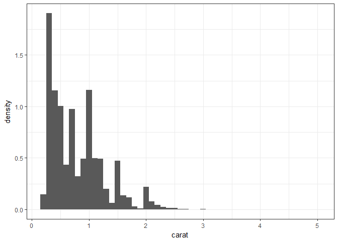

Plots should be carefully composed of layers; they can be intricately woven, but must paint a story that otherwise cannot be inferred from a table of the data Geoms can also be connected with other stats Three variations of the same histogram

``` r
ggplot(diamonds, aes(x = carat)) +
  stat_bin(aes(ymax = ..count..), binwidth = 0.1, geom = "area") 
```

    ## Warning: Ignoring unknown aesthetics: ymax

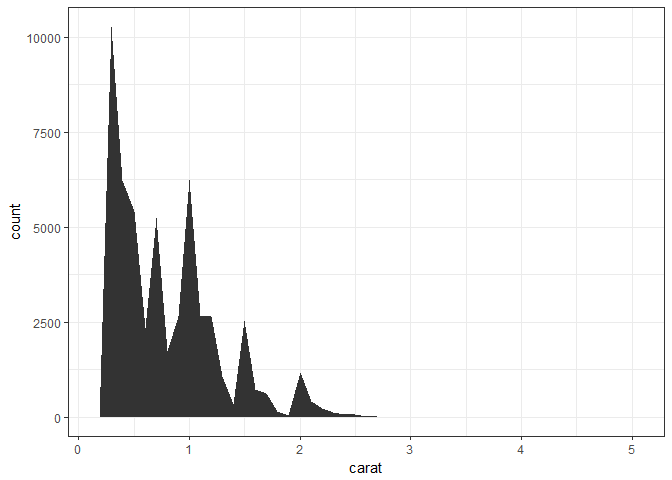

``` r
ggplot(diamonds, aes(x = carat)) +
  stat_bin(aes(size = ..density..), 
           binwidth = 0.1, geom = "point", position = "identity") 
```

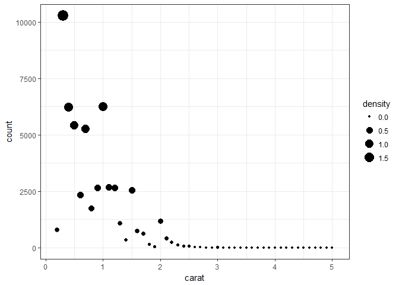

**OXBOYS data -- Age and height of 26 boys were measured on 9 occasions** *How does the height of boys vary by age and subject?*

``` r
model <- lmer(height ~ 1 + age + (age|Subject), data = Oxboys)

ggplot(Oxboys, aes(x = age, y = height, group = Subject)) +
  geom_line()
```

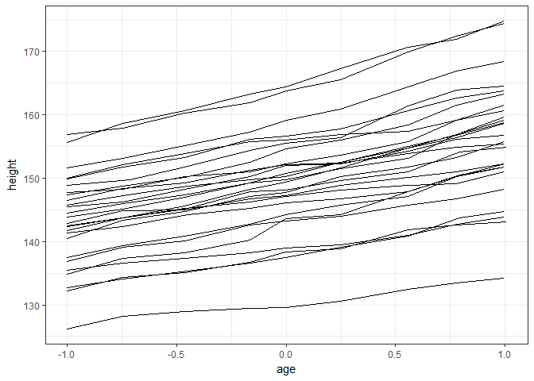

``` r
ageGrid <- seq(-1, 1, length.out = 10)
subjects <- unique(Oxboys$Subject)
preds <- expand.grid(age = ageGrid, Subject = subjects)
glimpse(preds)
```

    ## Observations: 260
    ## Variables: 2
    ## $ age     <dbl> -1.0000000, -0.7777778, -0.5555556, -0.3333333, -0.111...
    ## $ Subject <ord> 1, 1, 1, 1, 1, 1, 1, 1, 1, 1, 2, 2, 2, 2, 2, 2, 2, 2, ...

``` r
preds <- preds %>% mutate(height = predict(model, preds))

ggplot(Oxboys, aes(x = age, y = height, group = Subject)) +
  geom_line() +
  geom_line(data = preds, color = "blue", size = 0.4)
```

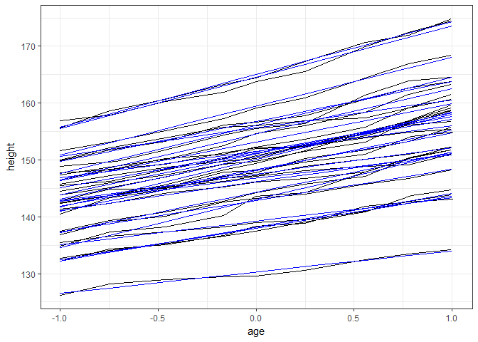
