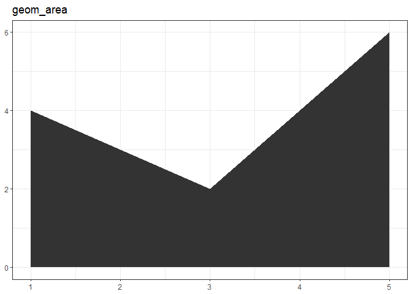

An overview of layer options for ggplot2
================
Pavan Gurazada
2018-01-31

``` r
library(tidyverse)
```

Build the plot in layers; think of each layer carefully and what purpose it serves Is it to display the data (and let the viewer build conclusions), present statistical summaries, or add meta data? **1. OVERVIEW OF PLOT TYPES**

``` r
df <- data.frame(x = c(3, 1, 5),
                 y = c(2, 4, 6), 
                 label = letters[1:3])

p <- ggplot(df, aes(x, y, label = label)) +
      xlab(NULL) +
      ylab(NULL)

p + geom_point() + labs(title = "geom_point")
```


``` r
p + geom_bar(stat="identity") + labs(title = "geom_bar")
```


``` r
p + geom_line() + labs(title = "geom_line")
```


``` r
p + geom_path() + labs(title = "geom_path")
```


``` r
p + geom_area() + labs(title = "geom_area")
```



``` r
p + geom_text() + labs(title = "geom_text")
```


``` r
p + geom_tile() + labs(title = "geom_tile")
```


**2. DISPLAYING DISTRIBUTIONS**

Use histograms for 1d distributions. In my experience, density plots are a bit misleading

*What is the distribution of depth of diamonds?*

``` r
p <- ggplot(diamonds, aes(x = depth))

p + geom_histogram(aes(y = ..density..), binwidth = 0.1) +
    facet_grid(cut ~ .)
```


``` r
ggplot(mpg, aes(x = class, y = cty)) +
  geom_jitter()
```


``` r
ggplot(mpg, aes(x = class, y = drv)) +
  geom_jitter()
```


**3. OVERPLOTTING**

Too many data points overlaid on one another obscuring the actual data density

``` r
df <- data.frame(x = rnorm(2000),
                 y = rnorm(2000))
```

One way to tackle it is to reduce the size of the geom point

``` r
p <- ggplot(df, aes(x, y))
p + geom_point()
```


``` r
p + geom_point(shape = 1)
```


``` r
p + geom_point(shape = ".")
```


Another way is to control the transparency of the points. This is my preferred option

``` r
p + geom_point(color = alpha("black", 1/3))
```


``` r
p + geom_point(color = alpha("black", 1/5))
```


``` r
p + geom_point(color = alpha("black", 1/20))
```


Discrete data can be handled with jitter

**4. DESCRIBING ESTIMATE UNCERTAINTY**

Specific geoms tackle intervals to describe uncertainty

Unfinished due to lack of good data to showcase, but geom\_errorbar is extremely useful to highlight uncertainty **5. ANNOTATION**

``` r
p <- ggplot(economics, aes(x = date, y = unemploy)) +
      geom_line() +
      xlab("") +
      ylab("No. unemployed (1000s)")
```

We can annotate specific regions in a plot to highlight patterns

These regions can be composed from other data sets too!

``` r
p + geom_vline(aes(xintercept = start), data = presidential)
```


