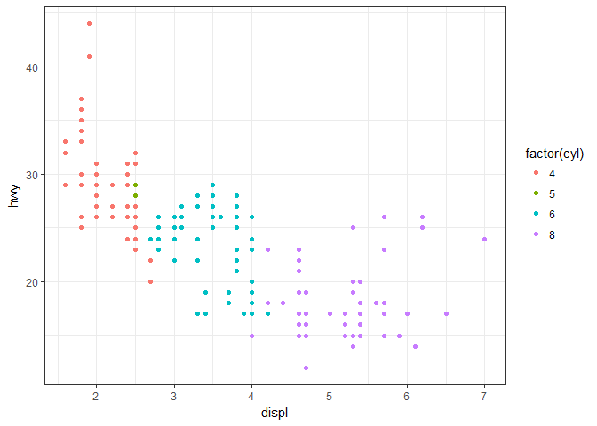
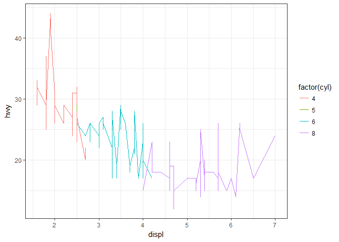
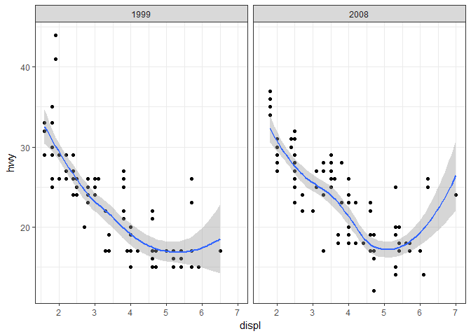

The grammar of ggplot2
================
Pavan Gurazada
2018-01-31

``` r
library(tidyverse)

set.seed(20130810)
theme_set(theme_bw())

data("mpg")
glimpse(mpg)
```

    ## Observations: 234
    ## Variables: 11
    ## $ manufacturer <chr> "audi", "audi", "audi", "audi", "audi", "audi", "...
    ## $ model        <chr> "a4", "a4", "a4", "a4", "a4", "a4", "a4", "a4 qua...
    ## $ displ        <dbl> 1.8, 1.8, 2.0, 2.0, 2.8, 2.8, 3.1, 1.8, 1.8, 2.0,...
    ## $ year         <int> 1999, 1999, 2008, 2008, 1999, 1999, 2008, 1999, 1...
    ## $ cyl          <int> 4, 4, 4, 4, 6, 6, 6, 4, 4, 4, 4, 6, 6, 6, 6, 6, 6...
    ## $ trans        <chr> "auto(l5)", "manual(m5)", "manual(m6)", "auto(av)...
    ## $ drv          <chr> "f", "f", "f", "f", "f", "f", "f", "4", "4", "4",...
    ## $ cty          <int> 18, 21, 20, 21, 16, 18, 18, 18, 16, 20, 19, 15, 1...
    ## $ hwy          <int> 29, 29, 31, 30, 26, 26, 27, 26, 25, 28, 27, 25, 2...
    ## $ fl           <chr> "p", "p", "p", "p", "p", "p", "p", "p", "p", "p",...
    ## $ class        <chr> "compact", "compact", "compact", "compact", "comp...

**For the cars data, how are engine size and fuel economy related?** We want to represent the relationship between two variables. Each observation is a point in the parameter space of these variables. In a plane with these two variables there are specific points that the observations occupy. The coordinates of an observation fix the point, which can further have a size, color and shape. These are the aesthetics of the data. A scatter plot represents the relationship between two features as observed in the data. The points that are present speak as much as those which are absent. From a scatter plot, given the value of a feature we can infer what the observations would be of the other feature

``` r
qplot(displ, hwy, data = mpg, color = factor(cyl))
```



A geometry is used to map a shape to the (naked) point and determines the type of the plot. Using a proper geometry to highlight the intention of the plot is crucial. A line instead of a point is grammatically correct, but is not meaningful

``` r
qplot(displ, hwy, data = mpg, geom = "line", color = factor(cyl)) 
```



This plot makes no sense, but why? Are we making any assumptions about the variable here? In a plot several geometries can be overlayed to present a statement about the data. *A picture is worth a thousand words.* Irrespective of the physical units of features, everything needs to be eventually mapped to pixels on a plot. This conversion is called scaling.

``` r
qplot(displ, hwy, data = mpg, color = factor(cyl))
```


Here, there are three aesthetics that need to be scaled - `x, y` and `color`. These three aesthetics (measured in pixels) need to be mapped to real life features (measured in miles/gallon, etc). While x and y scaling can be understood readily the scaling for color is not intuitive since it is not numeric; however, the mapping here can be understood as to a number-ish thing which is used to represent colors. Discrete values (e.g., categorical variables) are mapped to evenly spaced colors on the color wheel In sum, every point has the following aesthetics - x, y, color, size and shape. By defining these values, we provide all the information a computer needs to plot the dataset. In essence, the mapping from human discernable features to computer discernable aesthetics is complete. In sum, a plot is a computer rendering of geometry, scale and annotation. Hence, a plot is an complete representation of the data. Beyond merely representing data, plots are very useful to highlight patterns in the data. For e.g.,

``` r
qplot(displ, hwy, data = mpg, facets = . ~ year) + geom_smooth()
```

    ## `geom_smooth()` using method = 'loess'



The smoothing geometry represents the outcome of a statistical transformation applied to the data. The facets divide the mapping into groups and hence provide a layer of summary that was not evident in the previous plot. So, what is the high-level understanding of a plot? The data, mapping, statistic, geometry and position adjustment form a layer in a plot. Scales apply to all the data in a plot and control the mapping from data to aesthetics. Scales can transform continuous variables to size and color; discrete variables to shape and color. The layers and scales are placed on a coordinate system that controls the axes and the gridlines. In R-speak, a plot is a list with the following components: data, mapping, layers, scales, coordinates and facets.
