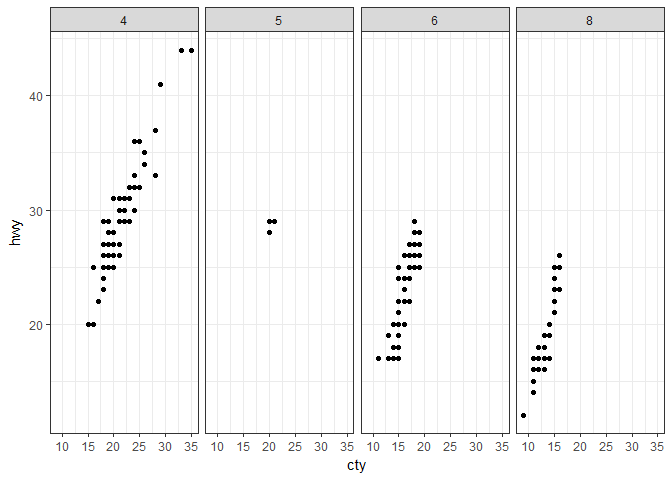
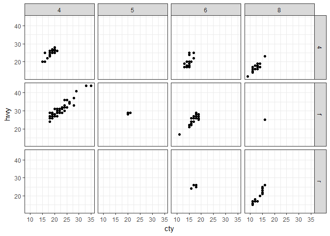
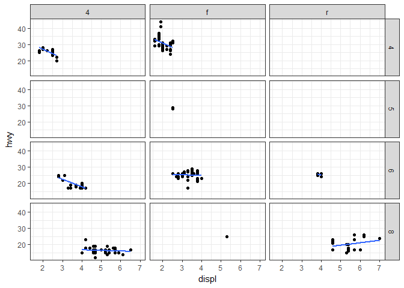
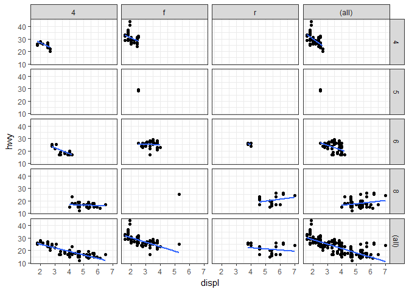
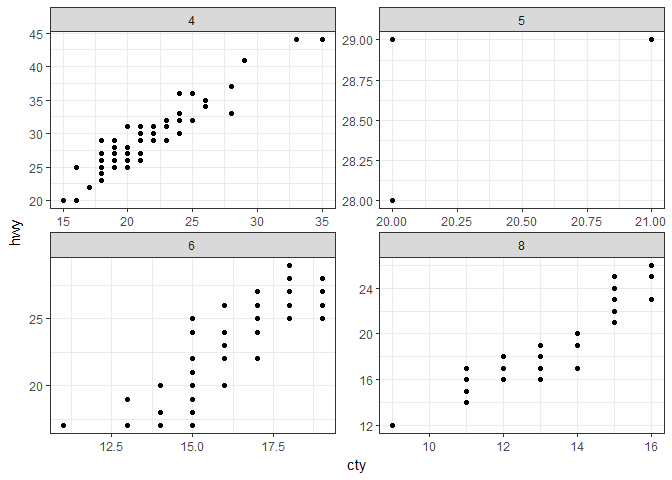

Facets
================
Pavan Gurazada
2018-01-31

``` r
library(tidyverse)
```

*Faceting* is an extremely useful visualization method to help compare patterns across various subsets of the data. Two kinds of facets can be created in ggplot2 - `facet_grid` that allows control on variables that go on the rows and the columns and `facet_wrap` that bends a 1d ribbon into 2d.

The faceting system requires a variable selection to go on the two axes. The `row_vars ~ col_vars` specification allows the user to specify this requirement in a rather easy way.

As can be seen from the following plots, faceting can be illuminating, and various specific subsets of the data can be explored for patterns easily

**1. Illustrating facet grids**

``` r
ggplot(mpg, aes(x = cty, y = hwy)) +
  geom_point() +
  facet_grid(. ~ cyl)
```



``` r
ggplot(mpg, aes(x = cty, y = hwy)) +
  geom_point() +
  facet_grid(cyl ~ .)
```


``` r
ggplot(mpg, aes(x = cty, y = hwy)) +
  geom_point() +
  facet_grid(drv ~ cyl)
```



``` r
ggplot(mpg, aes(x = displ, y = hwy)) +
  geom_point() +
  geom_smooth(method = "lm", se = FALSE) +
  facet_grid(cyl ~ drv)
```



One can build up the marginal plots just like in contingency tables

``` r
ggplot(mpg, aes(x = displ, y = hwy)) +
  geom_point() +
  geom_smooth(method = "lm", se = FALSE) +
  facet_grid(cyl ~ drv, margins = TRUE)
```



**2. Illustrating facet wraps**

This is usually used for a single variable with many levels and needs to be wrapped to fit screen resolution.

``` r
ggplot(mpg, aes(x = cty, y = hwy)) +
  geom_point() +
  facet_wrap(~ cyl)
```


**3. Controlling scales in the facets**

While we compare facets, it is important to pay attention to the scales used in each facet This can be controlled by the `scales =` parameter.

Notice how the plot below differs from the previous plot because of the scale freedom

``` r
ggplot(mpg, aes(x = cty, y = hwy)) +
  geom_point() +
  facet_wrap(~ cyl, scales = "free")
```



A key question to ask while faceting is: Will any other method of visual grouping will be equally efficient in capturing the pattern in the data? Facets are good for overall differences, but not so much if we are chasing fine grained details. In my experience, faceting is a neat feature when we are presenting differences observed in the same model on different substrate datasets or different models on the same data set. The simpler the faceting variable, the better it is!
