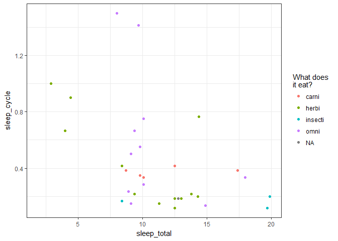
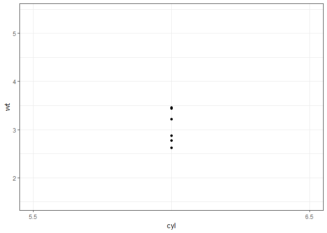
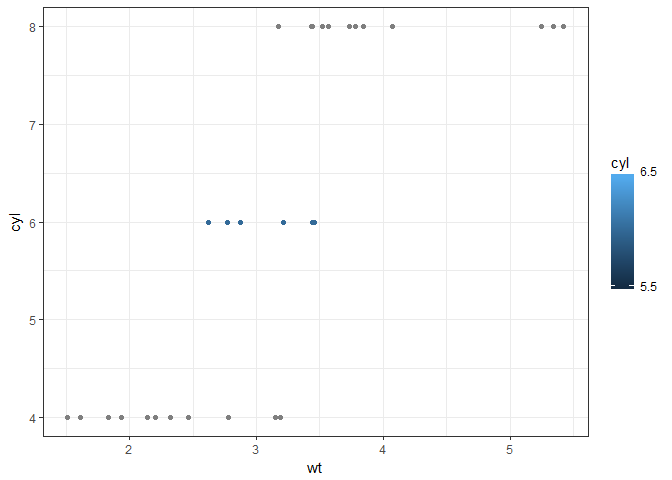
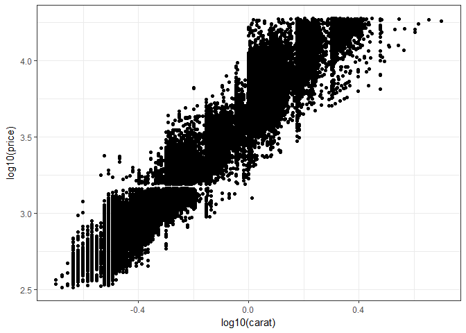
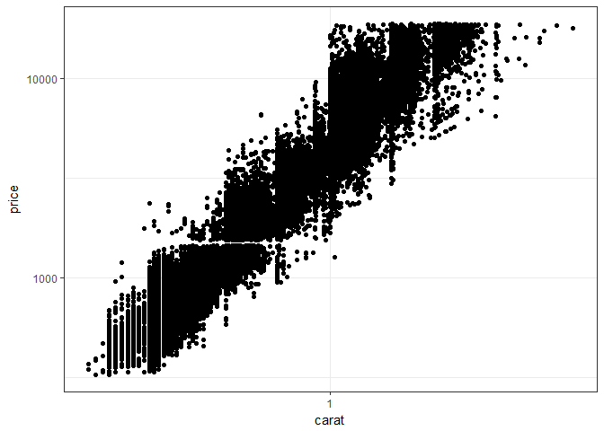
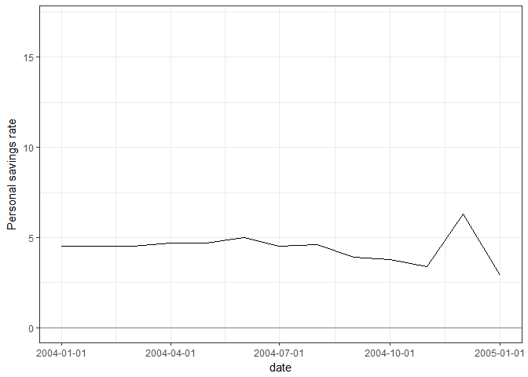
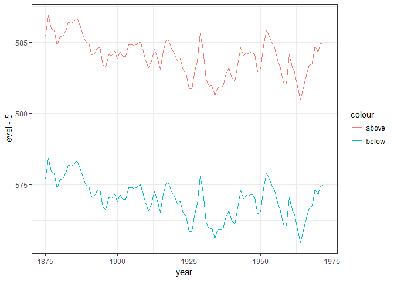
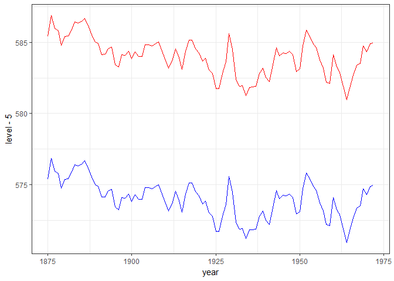
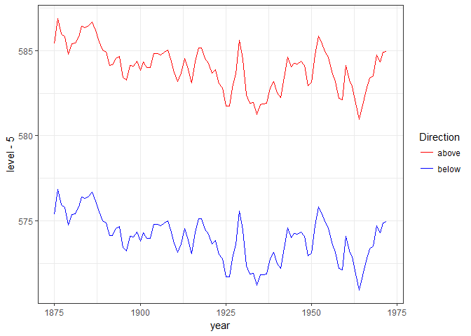

Scales and Legends
================
Pavan Gurazada
2018-01-31

``` r
library(tidyverse)
```

*Scales* translate real life data into the aesthetic space. Hence, the inputs are either discrete or continuos, which get mapped to parameters that R can understand. The scales of a plot can also be discrete or continuos. There are no explicit axis or legend tweaking functions in ggplot2. They are all managed through the `scale_` family of functions.

``` r
ggplot(msleep, aes(x = sleep_total, y = sleep_cycle, color = vore)) +
  geom_point() +
  scale_color_hue(name = "What does \nit eat?")
```

    ## Warning: Removed 51 rows containing missing values (geom_point).



`name` sets the label for the legend

`labs()` is a convenient way to set the labels for the axes and the legend

setting the `limits()` of the scale allows ggplot to skip the training phase

``` r
ggplot(mtcars, aes(x = cyl, y = wt)) +
  geom_point() +
  scale_x_continuous(breaks = c(5.5, 6.5),
                     limits = c(5.5, 6.5))
```

    ## Warning: Removed 25 rows containing missing values (geom_point).



``` r
ggplot(mtcars, aes(x = wt, y = cyl, color = cyl)) +
  geom_point() +
  scale_color_gradient(breaks = c(5.5, 6.5),
                       limits = c(5.5, 6.5))
```



Scale transformations are also very common and hence get their own shortcut functions. For instance, the following plots are identical but the scale labels are different

``` r
ggplot(diamonds, aes(x = log10(carat), log10(price))) +
  geom_point() 
```



``` r
ggplot(diamonds, aes(x = carat, y = price)) +
  geom_point() +
  scale_x_log10() +
  scale_y_log10()
```



Formatting date labels is also possible by tweaking the `date_labels` option

``` r
ggplot(economics, aes(x = date, y = psavert)) +
  geom_line() +
  geom_hline(yintercept = 0, colour = "grey50") +
  labs(y = "Personal savings rate") +
  scale_x_date(limits = as.Date(c("2004-01-01", "2005-01-01")),
               date_labels = "%Y-%m-%d")
```

    ## Warning: Removed 561 rows containing missing values (geom_path).



``` r
huron <- data.frame(year = 1875:1972,
                    level = LakeHuron)
```

Reason what is wrong with this plot

``` r
ggplot(huron, aes(x= year)) +
  geom_line(aes(y = level - 5, color = "below")) +
  geom_line(aes(y = level + 5, color = "above"))
```

    ## Don't know how to automatically pick scale for object of type ts. Defaulting to continuous.



Reason what is wrong with this plot

``` r
ggplot(huron, aes(x= year)) +
  geom_line(aes(y = level - 5), color = "blue") +
  geom_line(aes(y = level + 5), color = "red")
```

    ## Don't know how to automatically pick scale for object of type ts. Defaulting to continuous.



This is a perfect plot. Pause for a moment and reason out why this is so

``` r
ggplot(huron, aes(x= year)) +
  geom_line(aes(y = level - 5, color = "below")) +
  geom_line(aes(y = level + 5, color = "above")) +
  scale_color_manual(name = "Direction",
                     values = c("below" = "blue", "above" = "red"))
```

    ## Don't know how to automatically pick scale for object of type ts. Defaulting to continuous.


